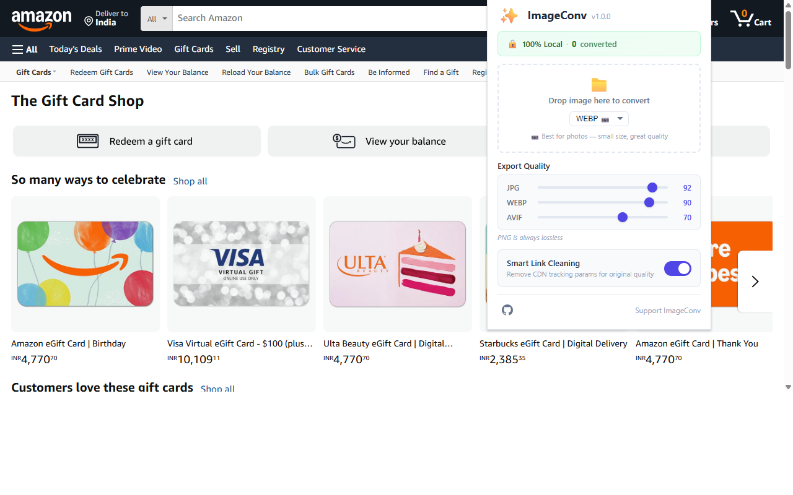
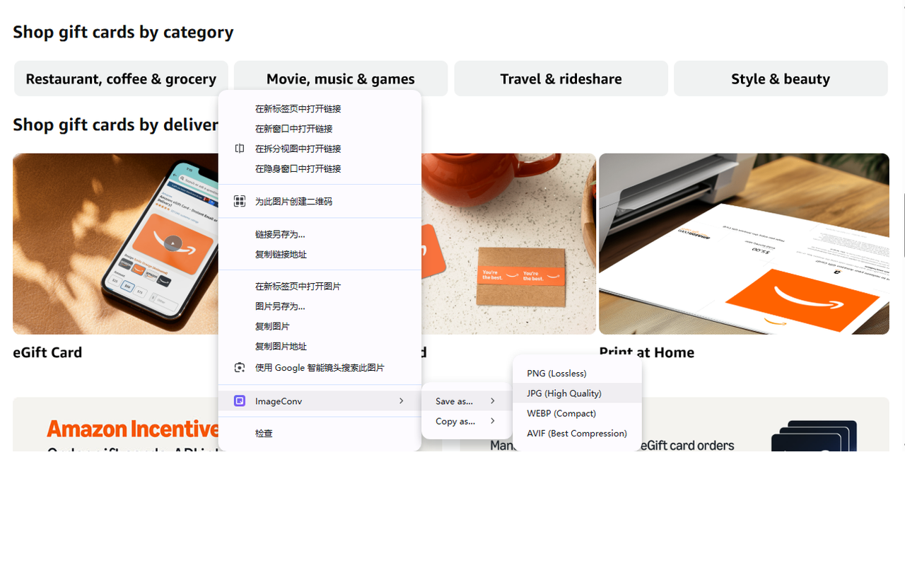

# ImageConv

English | [中文](README_zh.md) | [Español](README_es.md) | [Deutsch](README_de.md) | [日本語](README_ja.md) | [Français](README_fr.md)

A lightweight browser extension that converts images between PNG, JPG, WEBP, and AVIF formats — entirely locally, with zero data upload.

> Chromium-based · Manifest V3 · Zero tracking · 100% In-Browser Processing

---

## Why ImageConv?

Most image conversion tools require uploading your files to a remote server. ImageConv does everything inside your browser using the Canvas API — no data ever leaves your machine.

| Advantage | Detail |
|-----------|--------|
| 🔒 **100% Private** | All processing happens in your browser's memory. No servers, no uploads, no tracking. |
| ⚡ **Instant Conversion** | Images ≤5MB convert in under 500ms. No waiting for server round-trips. |
| 🎯 **Zero Dependencies** | Built with vanilla JavaScript and native Chrome APIs. No frameworks, no bloat. |
| 🌍 **6 Languages** | Auto-detects your browser language — English, Spanish, German, Japanese, French, Chinese. |
| 📋 **Copy & Save** | Right-click any image to save as a file OR copy directly to your clipboard. |
| 📁 **Drag & Drop** | Drop local images onto the popup for quick conversion. |

---

## Features

| Feature | Description |
|---------|-------------|
| 🖼️ **4 Formats** | Convert to PNG (lossless), JPG (high quality), WEBP (compact), or AVIF (best compression) |
| 📋 **Copy to Clipboard** | Right-click → Copy as PNG/JPG/WEBP/AVIF — paste directly into emails, chats, documents |
| 📊 **File Size Comparison** | Toast notification shows original vs converted size with savings percentage |
| 🎚️ **Adjustable Quality** | Fine-tune export quality for JPG, WEBP, and AVIF via sliders in the popup |
| 🔗 **Smart Link Cleaning** | Strips CDN tracking parameters (`w=`, `h=`, `format=`, `watermark=`, etc.) to fetch original images |
| 📁 **Drag & Drop** | Drop local image files onto the popup to convert without right-clicking |
| 🌐 **Cross-Origin Support** | Fetches images from any website via Service Worker — handles cross-origin resources internally |
| 🔤 **6-Language i18n** | Context menu and UI auto-match your browser language (EN/ES/DE/JA/FR/ZH-CN) |
| 🛡️ **JPG White Fill** | Automatically fills transparent backgrounds with white when converting PNG → JPG |
| ⏱️ **Duplicate Guard** | Ignores repeated clicks on the same image within 2 seconds |
| 📦 **Large Image Handling** | Images >20MB show an async processing indicator instead of freezing the UI |

---

## Preview

<!-- Replace with actual screenshots -->
<p align="center">
  
</p>

<p align="center">
  
</p>

---

## Supported Browsers

| Browser | Status |
|---------|--------|
| Google Chrome | ✅ Fully supported |
| Microsoft Edge | ✅ Fully supported |
| Brave | ✅ Supported |
| Opera | ✅ Supported |
| Vivaldi | ✅ Supported |
| Any Chromium-based browser | ✅ Supported (Manifest V3) |

---

## Installation

### From Source (Developer Mode)

1. Open your browser's extension page:
   - **Chrome**: `chrome://extensions/`
   - **Edge**: `edge://extensions/`
2. Enable **Developer mode** (top-right toggle)
3. Click **Load unpacked** and select the `pic-convert` folder
4. The ✨ ImageConv icon will appear in your toolbar

---

## Usage

### Right-Click Conversion

1. Right-click any image on a webpage
2. Select **ImageConv** from the context menu
3. Choose **Save as** or **Copy as**
4. Pick your format: PNG, JPG, WEBP, or AVIF
5. Done — file downloads instantly, or image is copied to clipboard

### Drag & Drop

1. Click the ImageConv icon in your toolbar to open the popup
2. Drag a local image file onto the drop zone
3. Select your target format
4. The converted file downloads automatically

### Quality Settings

Open the popup to adjust export quality for JPG, WEBP, and AVIF using the sliders. PNG is always lossless. Settings are saved automatically.

---

## Context Menu Structure

```
ImageConv
├── Save as PNG (Lossless)
├── Save as JPG (High Quality)
├── Save as WEBP (Compact)
├── Save as AVIF (Best Compression)
├── Copy as PNG (Lossless)
├── Copy as JPG (High Quality)
├── Copy as WEBP (Compact)
└── Copy as AVIF (Best Compression)
```

The **Copy as** and **Save as** menus only appear when right-clicking on images or links that point to image files (`.png`, `.jpg`, `.jpeg`, `.webp`, `.avif`, `.gif`, `.bmp`, `.jfif`, `.svg`).

---

## Privacy

ImageConv is built with privacy as a core principle:

- ✅ **Zero data upload** — All image processing happens in your browser's memory
- ✅ **No analytics** — No tracking, no telemetry, no remote calls
- ✅ **No cookies** — No reading or writing of browser cookies
- ✅ **No browsing history** — No access to your browsing data
- ✅ **Temporary memory only** — Images exist in memory during conversion and are immediately destroyed after
- ✅ **Minimal permissions** — Only requests what's strictly necessary: `contextMenus`, `downloads`, `offscreen`, `storage`, `clipboardWrite`

---

## How It Works

```
Right-click image
       ↓
Service Worker fetches image blob (handles cross-origin)
       ↓
Sends blob to Offscreen Document (hidden DOM with Canvas access)
       ↓
Canvas draws image at native resolution
       ↓
Exports as target format with specified quality
       ↓
Returns data URL → triggers download or copies to clipboard
       ↓
Destroys all temporary resources (blob, canvas, image element)
```

> **Why Offscreen?** Chrome's Manifest V3 runs the background as a Service Worker, which has no DOM access. The Canvas API requires a DOM, so we use Chrome's Offscreen API to create a hidden document for image processing.

---

## Export Quality Defaults

| Format | Quality | Notes |
|--------|---------|-------|
| PNG | Lossless | No quality setting — always preserves full quality and transparency |
| JPG | 92 | High quality, good balance between size and clarity |
| WEBP | 90 | Modern format, ~25-35% smaller than JPG at equivalent quality |
| AVIF | 70 | Next-gen format, ~20-30% smaller than WEBP, best for web delivery |

All quality values are adjustable via sliders in the popup (range: 10–100).

---

## License

Copyright © 2026 ImageConv. All rights reserved.

---

## ❤️ Support

If you find ImageConv helpful, consider supporting the project!

<!-- Add your support link here -->
**[👉 Support ImageConv](https://annmax1983.github.io/ImageConv/)**

---

> **Note:** All core conversion features will always remain free with no limitations.
